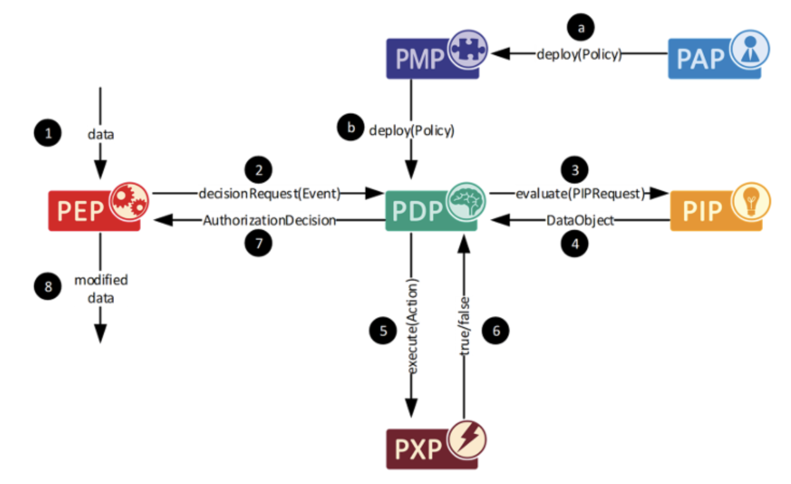
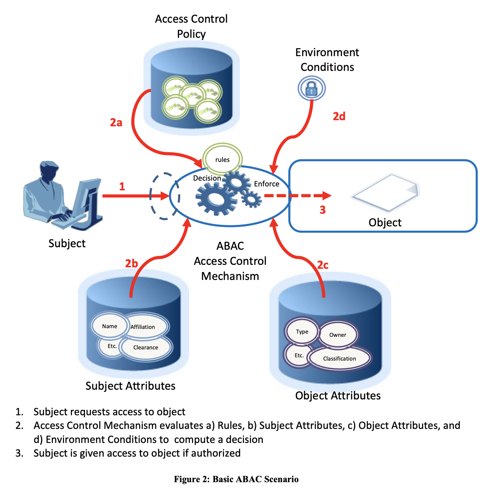
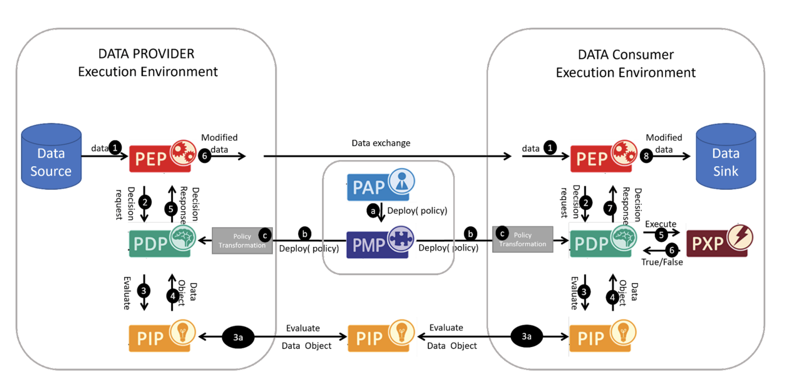
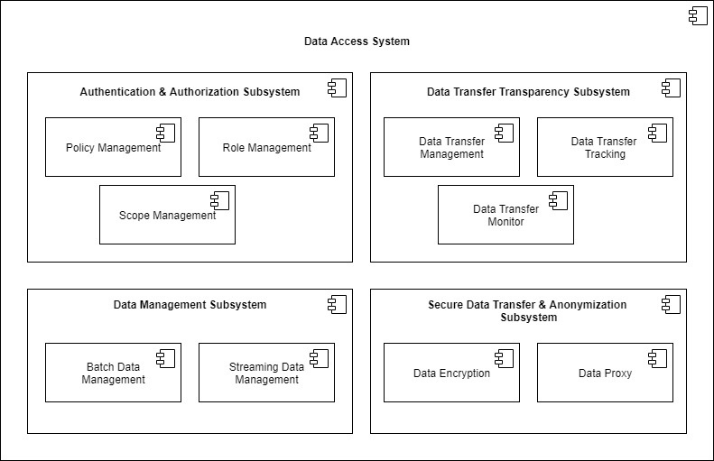

# Access and usage control
## Definition

This building block guarantees enforcement of data access and usage policies defined as part of the terms and conditions established when data resources or services are published (see ‘Publication and Services Marketplace’ building block below) or negotiated between providers and consumers. A data provider typically implements data access control mechanisms to prevent misuse of resources, while data usage control mechanisms are typically implemented on the data consumer side to prevent misuse of data. In complex data value chains, both mechanisms are combined by prosumers. Access control and usage control rely on identification and authentication.
  

  
<strong>CTO architecture coherence: Definition of concepts [DRAFT. NOT APPROVED]</strong>

  
  - [Access Control](https://www.techopedia.com/definition/5831/access-control)
  
    
Access control is a way of limiting access to a system or to physical or virtual resources. In computing, access control is a process by which users are granted access and certain privileges to systems, resources or information.In access control systems, users must present credentials before they can be granted access. In physical systems, these credentials may come in many forms, but credentials that can't be transferred provide the most security. 

  
  - [Usage Control](https://www.igi-global.com/dictionary/hardware-approach-trusted-access-usage/31145)
  
    
Usage Control complements access control with contextual predicates, conditioning the activation of a given privilege, and obligations, i.e., mandatory actions associated to the exercise of a privilege.

  
  - PIP/Directory Service
  
    
Where does the information come from to evaluate the rules from the policies and where to provide it. (Scope, roles, attributes).

     

## Role and Scope

Enforces different data access and usage policies that ensure trustworthiness of data sharing and exchange between participants.

## Features 

  
<strong>DSBA - CTO architecture coherence [DRAFT. NOT APPROVED]</strong>

 
- Access Control
- Usage Control
- Policy rules definition language
- Enforcement of policy rules
- Policy administration and management
- Definition of credentials / roles
- Usage Control for data sovereignty
  

## Components and Technologies

  
<strong>DSBA - CTO architecture coherence [DRAFT. NOT APPROVED]</strong>

  
- Policy Enforcement based on XACML, extend with PXP for Usage Policy Enforcement.
  
  Policies for Access Control and Usage Control should be managed in a similar way and should base on the same policy language. Therefore, the execution environments of both parties (data provider and data consumer) have to include some relevant components:
  
    - PAP Policy Administration Point: User interface to administer policies.
    - PDP Policy Decision Point: Evaluation of policies depending on context information.
    - PEP Policy Enforcement Point: Modification of data based on evaluation of PDP.
    - PIP Policy Information Point: Adding relevant context information (e.g. Scope, roles, attributes) to decide on policies, in distributed scenarios, e.g. Data Usage Policies, this could be a distributed /federated approach.
      

        
Detailed information about the PIP

        The policy information point might provide identity and authentication related data for (a) organizations, (b) Application execution environments and (3) individuals (Level 1, Level 2, Level 3). And additional attributes that are required for policy decisions on the object (data or service) and environment attributes. See figure below (source: NIST  Special  Publication  800-162,Guide  to  Attribute  Based  Access Control  (ABAC)  Definition and Considerations):
         
      

  
    - PMP Policy Management Point: Provisioning of actual policies.
    - PXP Policy Execution Point: Execution of activities from the policies _after_ data exchange and Enforcement of policies in PEP.
  
   
  
- IDSA: ODRL, XACML-oriented framework (PEP-PDP-PIP-PDP), Custom PAP
- FIWARE: XACML-like (iSHARE  [delegation evidence data model](https://dev.ishareworks.org/delegation/delegation-evidence.html), JSON port of XACML) implemented in Keyrock, XACML-based PEP-PDP-PAM framework, API Umbrella is iSHARE-compliant ([github](https://github.com/i4Trust/building-blocks#integrating-building-blocks-for-the-creation-of-i4trust-data-spaces), [Tutorials](https://github.com/i4Trust/tutorials)), XACML-based implemented in Keyrock (with AuthZForce component ([ReadTheDocs](https://authzforce-ce-fiware.readthedocs.io/en/latest/)), DID/VC/VP, FIWARE TRUE Connector component based on the MyData Framework ([github](https://github.com/Engineering-Research-and-Development/fiware-true-connector)).
  

  
<strong>i3-Market Project</strong>

  
- Blockchain Framework
- HW Wallet
- Explicit-User consent
- Backplane API

 

  
<strong>Resilience and Sustainability Data Space - ADVANEO</strong>

  
  - IDSA and GAIA-X standards
  - ADVANEO's Trusted Data Hub
  - IDS Components: broker, connector, clearing house and app provider

  
<strong>Intelligent Washing Machine - Haier | Fraunhofer ISST</strong>

 
  - COSMOPlat
  - IDS connector 
  - RFID sensor

  
<strong>IoF2020 - ATB Institute for Applied Systems Technology Bremen</strong>

  
  - CoatRack is a third-party backend-to-backend communications framework facilitating API access, monitoring and monetization. 
  - Open Source development, hosted in <a href="https://github.com/coatrack/coatrack">GitHub</a>.

  
<strong>iSHARE Foundation</strong>

  
  - iSHARE Open Source Authorisation Registry and Authorization exchange structure. 
    - Based on the Trust framework validated participants, parties can authorise each other data services (access control). 
    - Based on explicit consent, and with licenses that are providing usage control, the licenses organise the usage control from a legal perspective and form the foundation also for technical usage control. 

  
<strong>Tekniker - Wind Energy Data Space</strong>

  
  - Deployment of DataSpace Connectors as technical components responsible for the correct sharing of data between a data owner (e.g. wind farm operator) and a data user(e.g. component supplier).
  - Integration of the IDSA UPL through a Java Library in DataSpace Connectors for Usage Control Interoperability
  - Development, deployment and integration with DataSpace Connectors of a domain-agnostic Wind Farm Ontology WFOnt (https://w3id.org/wfont) for resource description interoperability.
  - Development and deployment of a Context-aware policy analysis method that integrated in DataSpace Connectors efficiently ensure policy quality avoiding security breaches in usage control while enhancing its performance.

  
<strong>i4Trust</strong>

  
  - A XACML-like architecture comprising PEP, PDP, PAP, PIP functions is implemented for access control.

  
<strong>SmashHit project</strong>

- Consent Manager: it is a core component of the smashHit platform that includes the functionality regarding the life cycle of the consent certifications. 
  The module interacts closely with the User Administration module since the users are the subject of the contracts. 
  The functions include the consent certification creation, management, consent distribution among the parties.
  
  

  
  

  
<strong>Kraken and CS4EU projects - ATOS</strong>

  
  - Ledger uSelf
  - Decentralized SSI solution
  - User centric access control to marketplace
  

  
## Technical Reference Implementation

  
<strong>Design Principles Position Paper</strong>

  
Enforcing Data Protection Regulations in Health Care Applications. When a company is processing patient records for the sake of accounting an billing as a service to doctors and insurances, it is thus in the interest of the company to ensure that it complies to those regulations.

  

  
<strong>IoF2020 - ATB Institute for Applied Systems Technology Bremen</strong>

  
 <a href="https://coatrack.eu/">CoatRack</a> is a third-party backend-to-backend communications framework facilitating API access, monitoring and monetization. CoatRack is a framework to manage backend-to-backend communication via REST services, consisting of: distributed, lightweight API gateways and a centralized web application to generate and manage those API gateways.

  
  CoatRack can facilitate your work if you have existing REST APIs and you want to do one (or more) of the following:
  - monitoring the access to your APIs
  - authentication/authorization of calls to your APIs via API keys
  - monetization of API calls, based on pay-per-call rules or flatrates

This project is part of [FIWARE](https://www.fiware.org/).

  
<strong>iSHARE Foundation</strong>

  
  - There are many existing usage of the iSHARE Framework already, with data of more than 1,5 million organisations being available today to authorise in line with the data governance act.

  
<strong>i4Trust</strong>

  
  - PEP and PDP functions are implemented by API gateways available in the FIWARE Catalogue. The extended version of the [Kong API gateway via plugins](https://github.com/FIWARE/kong-plugins-fiware) is recommended.
  - Implementation of PAP functions used to manage policies as well as the API to access such policies by PDP functions are implemented by the [Keyrock component](https://github.com/ging/fiware-idm) or any Authorization Registry compliant with iSHARE specifications. 
  - [Portfolio](https://i4trust.org/experiments/) of pioneer use cases relying on the i4Trust framework and the referred access control mechanisms.

  

  
<strong>Kraken and CS4EU projects - ATOS</strong>

KRAKEN project provides a decentralized SSI solution and user centric access control.
- SSI mobile app for managing VCs and key material
- Ledger USelf broker for SP integration
- Backup service allowing the use of sevarl devices

The Ledger uSelf asset (used in KRAKEN project) provides a decentralized SSI solution and user centric access control to the marketplace. The Ledger uSelf comprises an Android SSI mobile app (holders) for users managing VCs issued by trusted entities and key material (decentralized identifiers). Also, it includes a Ledger uSelf broker (server component) for facilitating the SSI integration both with the data providers (isuers) and the Service Providers (verifiers), simplifying the handling of SSI complex protocols and mechanisms. This implementation follows W3C standards and will follow digital wallet specifications from EC (eIDAS regulation).

## Business Use Cases Implementation

  
<strong>truzzt box</strong>

  
In the <a href="https://www.truzzt.com/en/">truzzt box</a> your documents are always available for you and you are always in control, not even truzzt has access to your personal documents. As a verified user of your truzzt box you always know who you are dealing with, you only buy from real, verified merchants and personal data will always remain encrypted and safe. Besides. The truzzt box will automatically adapt to your usage with its artificial intelligence. 

  

  
<strong>Resilience and Sustainability Dataspace - ADVANEO</strong>

  
Companies and organizations as users of the <a href="https://www.resilience-sustainability-dataspace.eu/">Resilience and Sustainability Dataspace</a> benefit from the data-based approach of a digital infrastructure to integrate decentralized information in a protected virtual space. With this infrastructure users are either able to apply already implemented services or to develop new services supporting our users in order to gain new insights and knowledge about. In the end, this enables users to seamlessly build their own trustworthy resilience and sustainability ecosystems. 

  

  
<strong>Intelligent Washing Machine - Haier | Fraunhofer ISST</strong>

  
Through sensors within washing machines laundry data can be collected, which enables companies to offer their consumers a better utilization of washing machines with additional services. This data is sent to COSMOPlat for optimizing washing programs through ML. The optimized washing programs are sent back to the consumers washing machines to save energy, time, and costs, as well as it reduces the carbon footprint and will lead to longer lasting garments.

  

 

  
<strong>Kraken and CS4EU projects - ATOS</strong>

  One of the use cases where this asset is used, involves end-users (e.g., data providers and data consumers) using the SSI mobile app for the onboarding/login processes on the marketplace, for selling or buying health or education data, under full user control.

  

## Best practices identification and recommendations

  
<strong>IoF2020 - ATB Institute for Applied Systems Technology Bremen</strong>

  
CoatRack facilitates the monetisation by API access control and monitoring, without determining the data format of content exchanged as long as the services are based on REST calls.

  
<strong>iSHARE Foundation</strong>

  
  - 
The Authorisation registry role is a federated role, open to data spaces to set this up specifically for specific data spaces. The role is open for organisations to either set it up themselves, but there is a growing market of market players providing commercial authorisation registry services.

  
<strong>SmashHit project </strong>

- Maintaining a common, well-known definition of at least the main legal terms in the consents which is accessible to all the different actors is, in our opinion, a must for this kind of system. 
In our case, we have chosen to base the consent manager on top of an ontology (https://smashhiteu.github.io/smashHitCore/) so that most of the process of defining the consent terms (purpose, roles, personal data categories…) is backed by this well-known model

  
<strong>Kraken and CS4EU projects - ATOS</strong>

The use of a SSI SDK already developed by Atos, which simplifies the embedding SSI solution, will be helpful for integrating the SSI solution with marketplace apps or legacy access systems.
  

## Gap or what is missing?

  
<strong>IoF2020 - ATB Institute for Applied Systems Technology Bremen</strong>

  
CoatRack offers the visualisation of access statistics. However, there is no practical payment feature yet included, to avoid monetary issues and demands with respect to banking regulations. 

  
<strong>i4Trust</strong>

  
Evolution of the FIWARE open source components used in the framework to support ABAC based on claims of Verifiable Credentials supported by issuers of requests is under way.

  
<strong>SmashHit project </strong>

We have not seen a clear block or feature devoted to manage the consent but we think that this is important in an Access and Usage Control, this is the reason we have added the consent Manager component, to complement the description of the Building Block

  

  

  
<strong>Kraken and CS4EU projects - ATOS</strong>

User consent could be included in the used VCs. 
LedgerUSelf is being evolved with SIOPv2 protocol (https://openid.net/specs/openid-connect-self-issued-v2-1_0.html) to allow integration of existing IAM solutions which support federated identity management protocols (OpenID Connect). This will be relevant for integration of such systems in data spaces initiatives like GAIA-X which is proposing SSI solutions based on SIOP and DID Comm protocols.
  

  
## TRL

## Comments

## Additional Information

  
<strong>IoF2020 - ATB Institute for Applied Systems Technology Bremen</strong>

  
  - [CoatRack's webpage](https://coatrack.eu/)
  - [GitHub repository](https://github.com/coatrack/coatrack)

  
<strong>Tekniker - Wind Energy Data Space</strong>

  
  - [Tekniker's webpage](https://www.daekinproject.com/en/)

  
<strong>i4Trust</strong>

  
  - [Additional information](https://github.com/i4Trust/building-blocks)

  
<strong>SmashHit project </strong>

You can find information in the following document https://smashhit.eu/public-report-d1-3-public-innovation-concept/ 
  The SmashHit Guidelines will be able to find online very soon, currently in progress.
  

  

  
<strong>Kraken and CS4EU projects - ATOS</strong>

-Kraken project deliverable D3.2 Self-Sovereign Identity Solution Final Release.
-DE4A project deliverable D5.8 Final Release of DE4A Self-Sovereign Identity Supporting Framework

