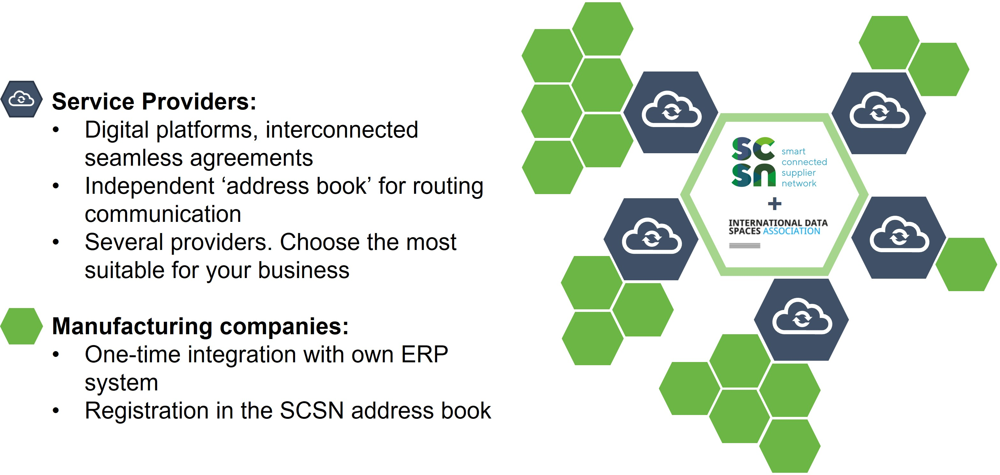
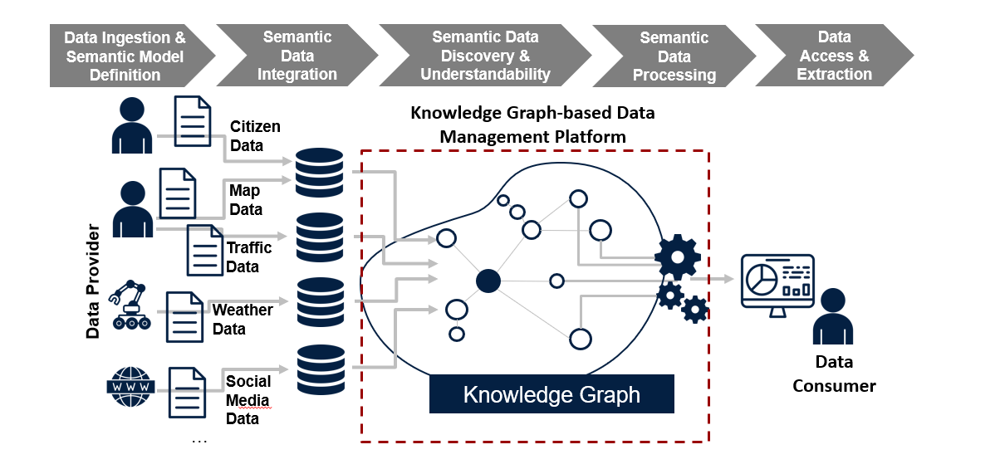

# Data Models and Formats

## Definition

This building block establishes a common format for data model specifications and serialization  of data in data exchange payloads. Combined with the Data Exchange APIs building block, this ensures full interoperability among participants.

## Role and Scope
It facilitates a common format for data model specifications and representation of data.

## Features 

  
<strong>DSBA - CTO architecture coherence [DRAFT. NOT APPROVED]</strong>

  
- Standardized  data format for exchange of messages
- Common data Models agreed among participants
- Provide data Models
- Describe data format

  
<strong>i3-Market Project</strong>

  
- Creation and registration of the data offering description

## Components and Technologies

  
<strong>DSBA - CTO architecture coherence [DRAFT. NOT APPROVED]</strong>

  
- JSON-LD (amongst others, like RDF)
- [Smart Data Models](https://github.com/smart-data-models)
- Vocabulary Provider Component
- The descriptions and more information in [IDS Infomodel](https://w3id.org/idsa/core). (RDF*, JSON-LD*, Linked Data Proofs, BBS+ Signatuores, ODLR, SHACL, Schema.org, ...)

  
<strong>i3-Market Project</strong>

  
- Semantic Engine
- Semantic Model (OCASUS)
- i3-Market SDK-Generator
- Distributed staraage, decentralized storage
- SDK-core; SDK-RI

  
<strong>Smart Connected Supplier Network</strong>

  
  - Use of the Universal Business Language (UBL)
  - ERP system.

  
<strong>Datavillage</strong>

  
  - Behavioral data mappers: components that map any behavioral data into the schema.org ontology are provided.

  
<strong>TECNALIA</strong>

  
  - Vocabulary Provider
  - Data Usage App
  - DAPS 

## Technical Reference Implementation

  
<strong>i3-Market Project</strong>

  
- Pricing Model
- Contract Model
- Data Schema
- Relational Data Schema

  
<strong>Smart Connected Supplier Network</strong>

  
SCSN is structured according to the four-corner model. The SCSN network is a network of networks in which all service providers/brokers are connected to each other. This enables every manufacturing company to communicate with all other manufacturing companies in the SCSN network, irrespective of the service providers to which the manufacturing companies are affiliated. This is made possible by strict technical and commercial agreements between the service providers, which are managed by the independent SCSN Foundation.

  
  

  
<strong>City Dataspace</strong>

    
1. Deploy batch data to the dataspace.
2. Provide streaming data to the dataspace.
3. Create semantic models for your data.
4. Find data
5. Create exports.
  
To know more about each step, visit the section <a href="https://www.city-dataspace.de/18-2/">Tutorials</a> of the City Dataspace webpage

  

  
<strong>DSWEU - Energy consumption in non-residential buildings</strong>

  
The <a href="https://i4trust.org/experiments/energy-consumption-in-non-residential-buildings/">experiment</a> will facilitate sharing of data using the standard NGSI-LD API to create digital twins. To develop more ambitious CO2-reduction projects for non-residential buildings, requires complete and up-to-date data on the measured energy consumption in relation to key construction features. With this data, Data Service Consumers can create digital twins of non-residential buildings, modelling the desired energy / CO2 reduction in various renovation scenarios for their clients.

## Business Use Cases Implementation

  
<strong>Design Principles Position Paper</strong>

The Smart Agrifood domain needs a common representation of agronomic data (e.g. crops, senso data from the field, multispectral imagery from UAVs, geolocation data, fertilisation logs, …). This common data model shall be used for all data exchanged between software components.

  
<strong>i3-Market Project</strong>

"Data offering" allows to describe the capabilities and interfaces of an i3-MARKET data asset from a provider perspective and how this information can be used for discovery and access purpose but at the same time provides information towards the commercial use of the data asset.

  
<strong>Smart Connected Supplier Network</strong>

The need of sharing data is crucial in low volume industry, like semiconductor industry. Nowadays, every industry adopts different standards and understandings of the same information, which provokes that a lot of work has to be done manually and it is not digitized. Furthermore, manual actions have a huge impact in the final price and they require extra effort. By using data standards and IDS components, the process is digitized, some errors are avoided and the effort is minimized. Besides, it enables the small manufacturing companies to join the digitalization process. Until now, they were sometimes excluded due to the high cost of hiring IT professionals (they have less budget).

  
<strong>City Dataspace</strong>

  
The City Dataspace focuses on the challenge of increasing and enabling the usability of Smart City relevant Open and Urban data using the example of mobility and geodata across municipal boundaries. It relies on the established semantic technologies, combined with new innovative concepts to simplify the use of the required technologies. This interoperability should enable app developers to develop an app once and roll it out to a large number of municipalities using the City Dataspace. Conversely, the City Dataspace enables municipalities to participate in existing apps just by making their data available.

  
<strong>DSWEU - Energy consumption in non-residential buildings</strong>

  
The idea is to test & showcasing the Dataspace Measured Energy Consumption in Non-Residential Buildings. To optimise the cost-effectiveness of CO2-reduction projects, non-residential building-owners need to share relevant data more easily but safely with their project partners.

  
<strong>Wind and Solar Assets modeling - EDF</strong>

  
The wind and solar description model is the digital backbone to federate all the businesses and its ecosystem around one single source of truth from “DESIGN, MODIFICATION to others REFRESHMENT”. Being able to share the same abstract representation of data for the wind and solar domain would allow a better understanding of the associated operations (asset management, RCA, Structural Analysis, Visual Inspection, monitoring ...) and an obvious improvement of the processes that mobilize the processing of this information.

## Best practices identification and recommendations

  
<strong>Datavillage</strong>

  
  - Use simple and basic ontology to start with and extend with specific ontology when required. 
  - In a user centric data space, use a user centric data model

  
<strong>TECNALIA</strong>

  
  - Ability to provide separate information if required.

## Gap or what is missing?

  
<strong>TECNALIA</strong>

  
  - Vocabulary provider
  - Link with other IDS components (e.g. Broker)

## TRL

## Comments

  
<strong>Smart Connected Supplier Network</strong>

  
  Results:
  - Cross-factory communication is facilitated.
  - By ensuring supply chain transparency and interoperability, the overall productivity has improvement of 20%.
  - The transaction costs of the supply chain are reduced.

  
<strong>TECNALIA</strong>

  
  - App concept in IDS has several limitations that should be overcome.

## Additional Information

