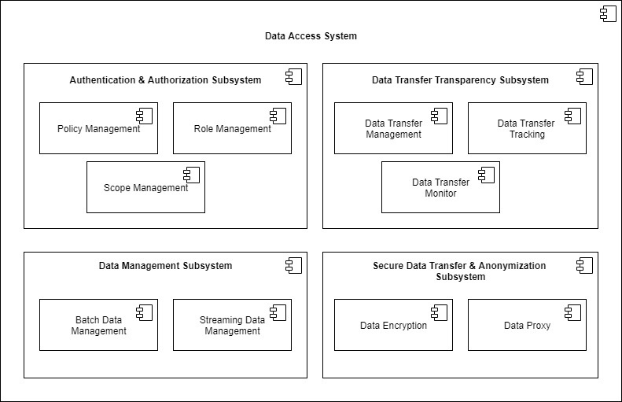
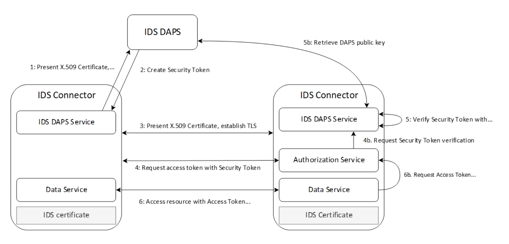

# Identity Management (IM)

## Definition

The IM building block allows identification, authentication, and authorisation of stakeholders operating in a data space. It ensures that organisations, individuals, machines, and other actors are provided with acknowledged identities, and that those identities can be authenticated and verified, including additional information provisioning1, to be used by authorisation mechanisms to enable access and usage control. The IM building block can be implemented on the basis of readily available IM platforms that cover parts of the required functionality.

## Role and Scope

Provides authentication and authorisation of data space participants.

## Features 1
**[TODO:] ASK FOR A DEFINITION OF FEATURES 1** 

  
<strong>DSBA - CTO architecture coherence [DRAFT. NOT APPROVED]</strong>

  
- Identification
- Authentication
- Authorization policy description language
- Authorization framework	

## Components and Technologies 1

  
<strong>Design Principles Position Paper</strong>

  

Examples of open-source solutions are the KeyCloak infrastructure, the Apache Syncope IM platform52, the open-source IM platform of the Shibboleth Consortium53, or the FIWARE IM framework54. It would be particularly important to integrate the IM building block with the eID building block of the Connecting Europe Facility (CEF)55 supporting electronic identification of users across Europe.
 

Creation of federated and trusted identities in data spaces can be supported by European regulations such as EIDAS.

  
<strong>DSBA - CTO architecture coherence [DRAFT. NOT APPROVED]</strong>

  
  
  **[TODO:] ASK FOR A DEFINITION OF LEVELS**
  
#### Level 1: Participant (organization, trusted party)
- eIDAS
- X.509
- VC/VP (planned)
- OpeniD/OAuth2 + iSHARE Satellite (current)
- Verifiable Data Registry (planned)
- OAuth2
- Participant Information Service as extension to Meta Data Broker
- OpenID Connect
- DID
- XACML variant by iSHARE (current)
- TBD (planned)
- XACML (recommended)
- XACML
- PEP-PDP-PAP

#### Level 2: Container or application execution environment.
(e.g. Connector)
- X.509
- DAT signed DAPS to coexist with VC/VP (planned)
- DAT signed DAPS (Oauth2 based),to coexist with VC/VP (planned)
- IDS ODRL-based to be reconciled with TBD (planned)
- ODRL (For usage control)
- Evolution of IDS Connector
- ODRL based
- PEP-PDP-PIP-PAP

#### Level 3: Application context/Users (individuals)
- User + password (current)
- VC/VP (planned)
- OpenID/OAuth2 (current)
- Verifiable Data Registry (planned)
- XACML variant by iSHARE (current)
- TBD (planned)
- ODRL (For usage control, applications), user behavior can be implemented regarding use case and environment.
- XACML
- PEP-PDP-PAP

  
<strong>i3-Market Project</strong>

  
User-centric Authentication.
- W3C Verifiable 
- Credentials Data Model 1.0
- W3C Decentralized Identifiers (DIDs) v1.0
  

  
<strong>EGI-ACE</strong>

  
  - <a href="https://www.egi.eu/service/check-in/">EGI Check-in service</a> based on Keycloack for OIDC provider

  
<strong>iSHARE Foundation</strong>

  
  - Identity providers are a key items to assure the trust, iSHARE utilises existing Identity providers and only sets requirements to identity providers to assure the same level of assurance or trust. Check out more information <a href="https://ishareworks.atlassian.net/wiki/spaces/IS/pages/70221987/Framework+and+roles">here</a>.

  
<strong>H2020 InterConnect</strong>

  
  - In the InterConnect Semantic Interoperability Framework ( SIF) we deployed a set of tool to account for the Trust building block, particularly the "Identity Management" and "Access & usage control". We rely in the "off-the-shelf" Keycloak IDP system to provide AAA services. 
  - Accounting is managed via the Service Store (component of the SIF) and via the Generic Adapters (InterConnect gateways). 
  - Lightweight Access & usage control is provided via this toolset. Trusted exchange is not explored.

## Features 2
**[TODO:] ASK FOR A DEFINITION OF FEATURES 2** 

  
<strong>DSBA - CTO architecture coherence [DRAFT. NOT APPROVED]</strong>

  
- Digital Identities and Authentication
- Digital Identities
- Authorization
- Identification & Authentication of Organisations, individuals, machines, etc.
- Authorization framework	

  
<strong>i3-Market Project</strong>

  
- Authentication and Authorization
  - Policy management
  - Role management
- Secure Data Transfer and Anonymization
  - Data Encryption
  - Proxy
- Data Transfer Transparency
  - Data Transfer Management
  - Data Transfer Tracking
  - Data Transfer Monitor
- Data Management
  - Batch Data Transfer Management
  - Data Stream Management

  
Go to the [source](http://open-source.i3-market.eu/technical-information/i3-market-architecture/) for more detailed information.

  
## Components and Technologies 2

  
<strong>DSBA - CTO architecture coherence [DRAFT. NOT APPROVED]</strong>

  
#### Level 1: Participant (organization, trusted party)
- W3C
- Verifiable Credentials
- X.509
- PKI
- CA

#### Level 2: Participant Information Service
- JWT

#### Level 3: Application context/Users (individuals)
- Keyrock IDM, which supports SSO [OpenID Connect](https://openid.net/connect/)/[OAuth2](https://oauth.net/2/), 2-FactorAuth and LDAP federation (currently)
- DID/VC/VP integration into i4Trust architecture for BC assisted authorization (under design, [architecture](https://github.com/hesusruiz/PrivacyCredentials/blob/main/docs/architecture/privacy-architecture.md))

  
  

## Technical Reference Implementation

  
<strong>Design Principles Position Paper</strong>

  

A user within an organisation registered with a data space provides his/her log-in credentials to the IM module in order to gain access to the data of the data space in line with his/her role in the organisation.

  
<strong>EGI-ACE</strong>

  
<a href="https://www.egi.eu/service/check-in/">EGI Check-in</a> is a proxy service that operates as a central hub to connect federated Identity Providers (IdPs) with EGI service providers. Check-in allows users to select their preferred IdP so that they can access and use EGI services in a uniform and easy way.

  
<strong>H2020 InterConnect</strong>

  

All interactions with the SIF require the use of AAA mechanisms. We host the IDP system as part of our backend that support all AAA features to our gateways ( Generic Adapters). The system relies in the reference implementation for OAuth 2.0.All interactions with the SIF require the use of AAA mechanisms. We host the IDP system as part of our backend that support all AAA features to our gateways ( Generic Adapters). The system relies in the reference implementation for OAuth 2.0.

## Business Use Cases Implementation

  
<strong>Catena-X</strong>

Based on sovereignty and standardization, Catena-X creates a network in which data exchange as well as the provision and use of value-added services is realized. Access to the network is centralized via the Catena-X Portal. With focus on usability, the portal integrates different Catena-X services on a suitable user interface.
 
  
  

Participants get access to different services and business applications. As a trusted network, the Catena-X Portal has the ability to solve daily challenges quickly and easily. Participants not only receive a transparent presentation of all offers and services, but also a resource-efficient connection to the value creation of the automotive industry.
 
  

The Catena-X portal will be implemented by means of a customer-friendly connection process and a central identity and user management system. On the other hand, a marketplace for applications and data as well as a developer hub will serve for the realization.
 

More details about [Catena-X Portal](https://catena-x.net/en/angebote/portal).

  
<strong>idento.io</strong>

As a verified user with <a href="https://www.idento.one">idento.one</a>, you can manage your digital identity from anywhere and on any device. Your idento.one dashboard gives you an overview of the digital services you use, from online banking to your social networks. You decide which service can access your data, when and how.  You keep control of your data, only you can share them with whom you want to and when you want to.

  
## Best practices identification and recommendations

  
<strong>i3-Market Project</strong>

  

W3C Verifiable Credentials specification provides a standard way to express credentials on the Web being cryptographically secure, privacy respecting, and machine-verifiable.

  

  
<strong>EGI-ACE</strong>

  
  - Federation of Identity providers and proxy component. 
  - Combination of user attributes originating from various authoritative sources (IdPs and attribute provider services) and delivers them to the connected Service providers in a transparent way.

  
<strong>iSHARE Foundation</strong>

  The EIDAS framework is at the same level of trust, hence EIDAS and iSHARE are connected, further reading <a href="https://ishareworks.atlassian.net/wiki/spaces/IS/pages/70221987/Framework+and+roles">here</a>.

  
<strong>H2020 InterConnect</strong>

  

For this building block we implemented a Security and Privacy Plan (SPP) devised within the project. In a nutshell is a joint approach for using STRIDE and LINDUN approaches, enabling our service owners (the users of the SIF) to take informed decisions. 

## Gap or what is missing?

  
<strong>EGI-ACE</strong>

  
  - Evolution towards SSI.

## TRL

## Comments

## Additional Information

  
<strong>iSHARE Foundation</strong>

  
  - <a href="https://ishareworks.atlassian.net/wiki/spaces/IS/pages/70221987/Framework+and+roles">Framework and roles</a>.

