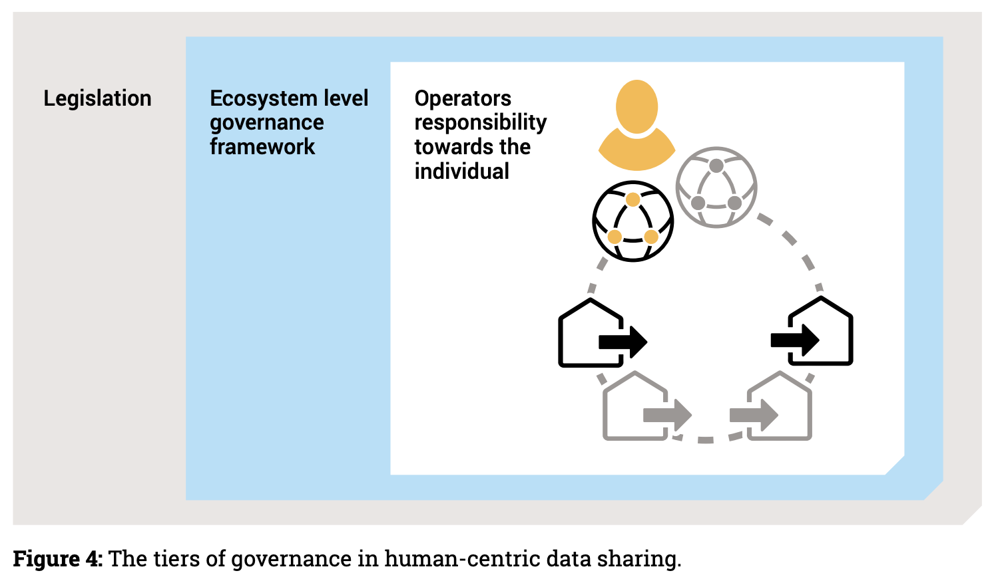

# Organisational/operational building blocks

## Definition

The organizational level refers to the way in which the agreements, expectations and processes are aligned to achieve the common goals for controlled data sharing. This includes the onboarding and certification (according to common and accepted criteria), aligned service level agreements (for realizing overarching expectations and quality control) and aligned operations and customer processes (for improved operating efficiency and enhanced customer experience).

## Role and Scope

## Features

<strong>Design Principles Position Paper</strong>

* Domain Data Standard
* Unique Identifiers
* Authorisation Registries
* Trusted Parties
* Data Space Boards
* Overarching cooperation Agreements
* Continuity Model
* Regulations

## Components and Technologies

<strong>i3-Market Project</strong>

* Embedded Ledger
* Database
* Smart Contracts for Permissioning
* Synchronization: The distributed storage database must support data synchronization between nodes.
* Semantic Database
* API for External Access

For more detailed information, visit the [source's webpage.](http://open-source.i3-market.eu/technical-information/data-storage-system-specifications/)

<strong>EGI - ACE</strong>

* ITSM Coordination, an IT Service Management (ITSM) framework based on FiTSM

<strong>iSHARE Foundation</strong>

<strong>European Union Agency for Railways - ERA</strong>

* Ontologies KNOWLEDGE graph
* Shacl
* Linked data
* FAIR principles

<strong>MyData</strong>

The ecosystem created by operators, working with data sources and data using services, is always part of a broader, social and economic system of individuals, communities, public organisations and private companies. Therefore, the ecosystem functions within the wider context of legislation, regulation, and social norms. Legislation is necessary for the creation of trust, but it is not sufficient. In order to create a level playing field in the market, rules of engagement between the different roles and actors fulfilling those roles are needed.\

Read more in [Understanding MyData Operators](https://mydata.org/wp-content/uploads/2022/03/Understanding-MyData-Operators-2022.pdf)

<strong>i4Trust</strong>

* i4Trust technology building blocks can be used with different governance frameworks but the one implemented by iSHARE is given as one possible reference.

## Technical Reference Implementation

<strong>iSHARE Foundation</strong>

Data Spaces build upon [iSHARE](https://ishare.eu/ishare/the-foundation/governance/)’s trust framework define their own standards and working and governance. Within that governance data spaces decide on the Taxonomy, Interoperability and Value creation of the data within the data space.

<strong>European Union Agency for Railways - ERA</strong>

* [Route compatibility check](https://data-interop.era.europa.eu/)

<strong>i4Trust</strong>

* See [this](https://ishare.eu/ishare/the-foundation/governance/) for an example of governance that can be implemented for data spaces using i4Trust building blocks.

## Business Use Cases Implementation

<strong>EGI - ACE</strong>

ITSM Coordination oversees the implementation and evolution of the IT service management system across EGI. The service designs and implements structured processes for the improvement of service delivery to its customers.

<strong>iSHARE Foundation</strong>

iSHARE is used in a lot of existing data spaces: Logistics, Energy, Building, Agriculture, Maritime.

## Best practices identification and recommendations

<strong>EGI - ACE</strong>

* Repeatability: Services and processes operate the same way time after time.
* Quality: Repeatable processes can be monitored and optimized to increase quality.
* Demonstrability: Following a standard allows quality to be audited and demonstrated to others.
* Compatibility: Managed services can be combined with other services by customers, or in federated provision scenarios.
* Professionalism: Formally managed services appear more professional to customers.

<strong>iSHARE Foundation</strong>

* A generic legal framework severely lowers the threshold of sharing confidential data.

<strong>European Union Agency for Railways - ERA</strong>

* FAIR

## Gap or what is missing?

<strong>EGI - ACE</strong>

* Network of Trainer for FiTSM.

## TRL

## Comments

## Additional Information

<strong>EGI - ACE</strong>

* [EGI - ITSM Coordination](https://www.egi.eu/service/itsm-coordination/)

<strong>iSHARE Foundation</strong>

* [iSHARE Data Licenses explained](https://ishare.eu/licenses/)
* [Legal Provisions](https://ishareworks.atlassian.net/wiki/spaces/IS/pages/75006103/Legal+provisions)
* [Benefits for data spaces](https://ishare.eu/ishare/benefits/for-data-spaces/)

<strong>European Union Agency for Railways - ERA</strong>

* [SPARQL Query Editor](https://linked.ec-dataplatform.eu/sparql/)
* [ERA Vocabulary](https://data-interop.era.europa.eu/era-vocabulary/)
* [Route Compatibility Check](https://data-interop.era.europa.eu/)

