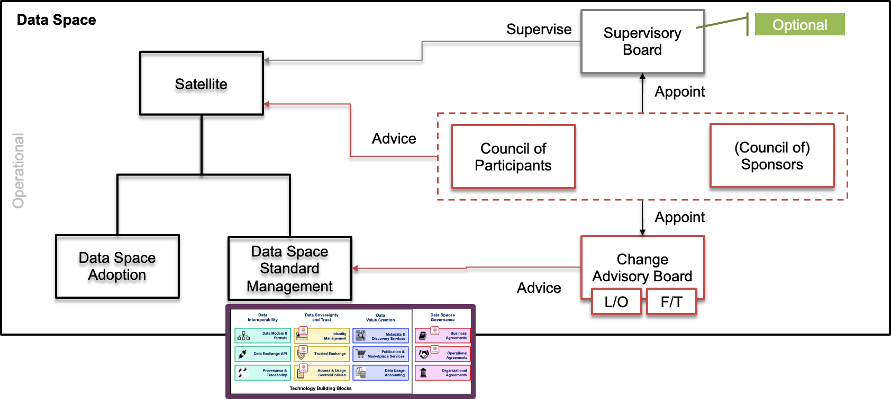

# Organisational/operational building blocks

## Definition

[TO DO. Provisional: http://open-source.i3-market.eu/technical-information/data-storage-system-specifications/]. The common data shared between participating data marketplace instances may include identity information, shared semantic models, meta-information about data sets and offerings, semantic queries, sample data, smart contract templates and instances, crypto tokens and payments. No single party should fully control the data storage system and there shall be no single point of failure.
 

## Role and Scope

## Features

## Components and Technologies

  
<strong>i3-Market Project</strong>

  
- Embedded Ledger
- Database
- Smart Contracts for Permissioning
- Synchronization: The distributed storage database must support data synchronization between nodes.
- Semantic Database
- API for External Access
  
For more detailed information, visit the [source's webpage.](http://open-source.i3-market.eu/technical-information/data-storage-system-specifications/)

  
<strong>EGI - ACE</strong>

  
  - ITSM Coordination, an IT Service Management (ITSM) framework based on FiTSM
  

  
<strong>iSHARE Foundation</strong>

  
The <a href="https://ishareworks.atlassian.net/wiki/spaces/IS/pages/75006103/Legal+provisions">iSHARE Legal framework</a> provides coverage of the data usage and sharing, with that providing legal coverage of data sharing for all participants. Through the generic legal framework parties don't need to have separate bilateral agreements for data sharing, because the use of the iSHARE authorisation registry standard will generate data set specific agreements, per data share and per data autorisation.
 

  
The legal framework provides legal entities the certainty that data is always handled with care and responsibility, parties are liable of behaving according to the licences provided by the actual data that is shared. iSHARE organises data access with explicit and technically enforced consent, and the usage control is covered in a technically readable and legal way.

  
On top of the baseline legal coverage of data sharing there are generic <a href="https://ishareworks.atlassian.net/wiki/spaces/IS/pages/70222199/Service+levels">Service Levels</a> that are defined for Service Providers, Service Consumers and certified roles (Authorisation Registers, Identity Providers and Satellites), to allow for technical workability of the data space.
 

  
It's open for data spaces to create additional operational and legal measures, which are all technically verifiable in the <a href="https://ishare.eu/ishare/benefits/for-data-spaces/">ledger</a>.

## Technical Reference Implementation

  
<strong>iSHARE Foundation</strong>

  
Data Spaces build upon <a href="https://ishare.eu/ishare/the-foundation/governance/">iSHARE</a>’s trust framework define their own standards and working and governance. Within that governance data spaces decide on the Taxonomy, Interoperability and Value creation of the data within the data space.

  
  

## Business Use Cases Implementation

  
<strong>EGI - ACE</strong>

  
ITSM Coordination oversees the implementation and evolution of the IT service management system across EGI. The service designs and implements structured processes for the improvement of service delivery to its customers.

  

  
<strong>iSHARE Foundation</strong>

  
iSHARE is used in a lot of existing data spaces: Logistics, Energy, Building, Agriculture, Maritime. 

## Best practices identification and recommendations

  
<strong>EGI - ACE</strong>

  
  - Repeatability: Services and processes operate the same way time after time.
  - Quality: Repeatable processes can be monitored and optimized to increase quality.
  - Demonstrability: Following a standard allows quality to be audited and demonstrated to others.
  - Compatibility: Managed services can be combined with other services by customers, or in federated provision scenarios.
  - Professionalism: Formally managed services appear more professional to customers.
  

  
<strong>iSHARE Foundation</strong>

  
  - 
A generic legal framework severely lowers the threshold of sharing confidential data.

## Gap or what is missing?

  
<strong>EGI - ACE</strong>

  
  - Network of Trainer for FiTSM.
  

## TRL

## Comments

## Additional Information

  
<strong>EGI - ACE</strong>

  
  - [EGI - ITSM Coordination](https://www.egi.eu/service/itsm-coordination/)
  

  
<strong>iSHARE Foundation</strong>

  
  - [iSHARE Data Licenses explained](https://ishare.eu/licenses/)
  - [Legal Provisions](https://ishareworks.atlassian.net/wiki/spaces/IS/pages/75006103/Legal+provisions)
  - [Benefits for data spaces](https://ishare.eu/ishare/benefits/for-data-spaces/)

