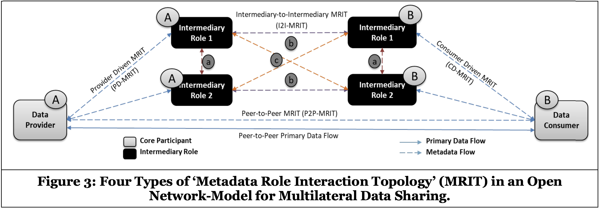
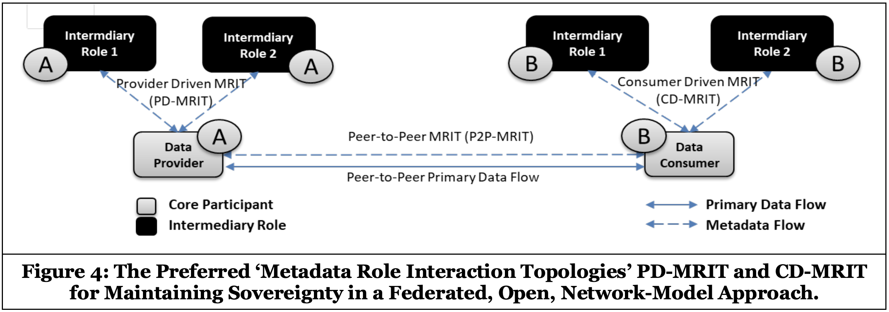

# Provenance and traceability

## Definition

This building block provides the means for tracing and tracking in the process of data provision and data consumption/use. It thereby provides the basis for a number of important functions, from identification of the lineage of data to audit-proof logging of transactions. It also enables implementation of a wide range of tracking use cases at application level, such as tracking of products or material flows in a supply chain.
 

## Role and Scope

Enables traceability of provenance, access, and usage of data shared and exchanged in a data space

## Features 

  
<strong>DSBA - CTO architecture coherence [DRAFT. NOT APPROVED]</strong>

  
- Audit-proof logging of data exchange transactions
- Data Provenance Tracking
  

## Components and Technologies

  
<strong>DSBA - CTO architecture coherence [DRAFT. NOT APPROVED]</strong>

  
- Integration with multiple DLTs using [FIWARE Canis Major](https://github.com/fiware/CanisMajor) component
- [Infrastructural Sovereignty over Agreement and Transaction Data, figure 3 and 4](https://ris.utwente.nl/ws/portalfiles/portal/182217093/Infrastructural_Sovereignty_over_Agreement_and_Transaction_Data_.pdf)
  
   
  
   
  

## Technical Reference Implementation

  
<strong>Design Principles Position Paper</strong>

  

In the scope of a circular supply chain, there is need for providing end-to-end traceability of the status and conditions of key circular entities, like products or materials. The building block allows authorised participants to query on the status of specific products and materials, and to receive detailed information about their status and location in the circular chain.

  

## Business Use Cases Implementation

## Best practices identification and recommendations

## Gap or what is missing?

## TRL

## Comments

## Additional Information
