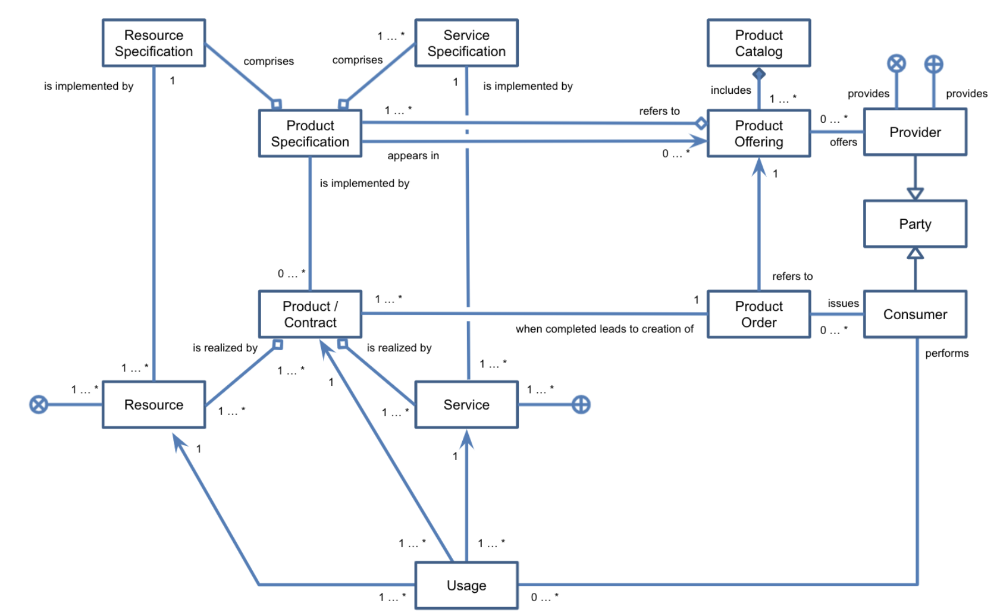

# Publication and Marketplace Services
## Definition

To support the offering of data resources and services under defined terms and conditions, including applicable pricing models, marketplaces must be established. This building block supports publication of these offerings, management of processes linked to the creation and monitoring of smart contracts (which clearly describe the rights and obligations for data and service usage), and access to data and services. 
 

## Role and Scope

Provides a directory of the various data assets for dynamic access and discovery as well as management of established contracts.

## Features 

  
<strong>DSBA - CTO architecture coherence [DRAFT. NOT APPROVED]</strong>

  
- Publication and Query
- Standard information model and supporting APIs for the implementation of data marketplace services
- Backend components implementing marketplace services
- Data Catalogue / Publication functions to publish data resources which can be found via metadata and are connected with marketplace
- (Portal) Public marketplace human readable information and marketing things, landing page,...

  
## Components and Technologies

  
<strong>i3-Market Project</strong>

  
- DSA/DPA Smart Contract

  
<strong>H2020 InterConnect</strong>

  
- 
In the InterConnect Semantic Interoperability Framework (SIF) we build a custom marketplace web application to cater for our needs. It provides a repository of interoperable services in which users (other service owners) can use to navigate and interface with. Onboarding and acquiring access to the resources is also done via this marketplace.

  
<strong>Looming Factory - i2Cat Foundation</strong>

  
- 
For this App Store, we extended the Open Source project available on the IDSA Git Hub repository. We instantiated an App Store using containerization technologies (Docker) and implemented it with Java and Spring Boot. We also extended the App Store with a user-friendly frontend using React.

  
<strong>i4Trust</strong>

  
i4Trust incorporates marketplace services relying on TM Forum Open API recommendations: 
  - Product/Service/Resource Catalog Management (including Product/Service/Resource Specifications): TMF620, TMF633, TMF634
  - Product/Service/Resource Ordering Management: TMF622, TMF641, TMF652
  - Product/Service/Resource Inventory Management: TMF637, TMF638, TMF639
  - Usage Management: TMF635
  - Party Management: TMF632
  - Customer Management: TMF629
  - Account Management: TMF666

Data sets associated to Data access services can be published through Publication Portals and services following W3C DCAT and EU DCAT-AP recommendations.

## Technical Reference Implementation

  
<strong>Design Principles Position Paper</strong>

  

A data space user queries the data resources publication platform on specific data assets (e.g. based on content, theme, industry, etc.). Upon selecting the dataset she/he wants to access, she/he receives a link (e.g. an URL) to the dataset chosen.

  

  
<strong>DSBA - CTO architecture coherence [DRAFT. NOT APPROVED]</strong>

  Simplified version of model specified by TM Forum:
  
   

  
<strong>H2020 InterConnect</strong>

  
  
Since this is custom tool, we applied interConnect's reference architecture, providing a tool for the owners of a digital service to engage with the ecosystem and through their first interaction with the SIF, understand how make their services interoperable.

  
<strong>Looming Factory - i2Cat Foundation</strong>

  

The App Store is based on the IDS-RAM 3.0 and its Open Source implementations.

  
<strong>i4Trust</strong>

  
  - An [open source implementation of marketplace functions](https://github.com/FIWARE-TMForum/Business-API-Ecosystem) compliant with TM Forum recommendations can be found in the FIWARE Catalogue, concretely in connection to the BAE component.
  - Data sets associated to data access services offered through the marketplace can be published on CKAN publication portals supporting the CKAN extensions available in the [FIWARE Catalogue](https://github.com/conwetlab/FIWARE-CKAN-Extensions). They can also be published through the [Idra FIWARE component](https://github.com/OPSILab/Idra).

## Business Use Cases Implementation

  
<strong>Mobilithek (former MDM - Mobility Data Marketplace)</strong>

  

Traffic and mobility data are becoming the raw material for multimodality, automated and connected driving, and other future solutions. <a href="https://www.mdm-portal.de/?lang=en">MDM</a> offers suppliers and users of mobility to share, search and subscribe to traffic-relevant online data (traffic flows, traffic jams, road works, mobility options, parking facilities and more). The MDM is continuously working to make as much mobility data as possible accessible, across different means of transport, network elements and actors.

 

  
<strong>Looming Factory - i2Cat Foundation</strong>

  

The use case behind the App Store is offering specialized third-parties the possibility to publish Data Analysis and AI applications that can be reutilized by multiple interested users, specifically in the Industry 4.0 sector. During the life of the project, 2 - 3 applications will be implemented and made available in the App Store to be used by the industrial partner of the project.

## Best practices identification and recommendations

  
<strong>H2020 InterConnect</strong>

  
  - We relied in the SPPs devices within interconnect, detailed in the [Identity Management file](./identity_management.md).

  
<strong>Looming Factory - i2Cat Foundation</strong>

  
- 
The harmonization of the technical requirements to deploy Data Apps between an App Store and the corresponding Connectors is crucial.

  
<strong>i4Trust</strong>

  
  - Adoption of standard APIs for the management of the lifecycle of Products (implemented as Services and underlying Resources) and Product Offerings is key to enable monetization of data services.
  - Marketplace functions should not only be focused on data sets but data (access and processing/app) services.  Indeed, data sets can be seen as the result of invoking data access services.

## Gap or what is missing?

  
<strong>H2020 InterConnect</strong>

  
  - The Data usage account building block should enforce the rewards for data owners and an expedite approach for cross-domain, implying interactions with multiple data-spaces and particularly when using distinct reference implementations of the components.

  
<strong>Looming Factory - i2Cat Foundation</strong>

  
- 
The certification and validation process of the Apps before being published in the App Store is an ongoing topic. More automatic checks can be added to the App Store to filter out malicious Apps, as well as an optional manual certification process to guarantee the correct functioning of the app.

- 
The App Store still seems to not be easily accessible by non-technical users, considering the necessary steps that need to be done to download, negotiaite and deploy a Data App in a Connector. This process can be made easier by expanding the App Store's UI to allow for more complete actions by the interested users.

## TRL

## Comments

## Additional Information

  
<strong>i4Trust</strong>

  
Data Publication and Data Services Marketplace functions should be separated in different building blocks, the former supporting DCAT standards while Data Services Marketplace functions should rely on TM Forum recommendations. Taxonomy of building blocks in this pillar may be:
- Meta data and data sets Publication and Discovery
- Data Services Marketplaces
- Data usage accounting

