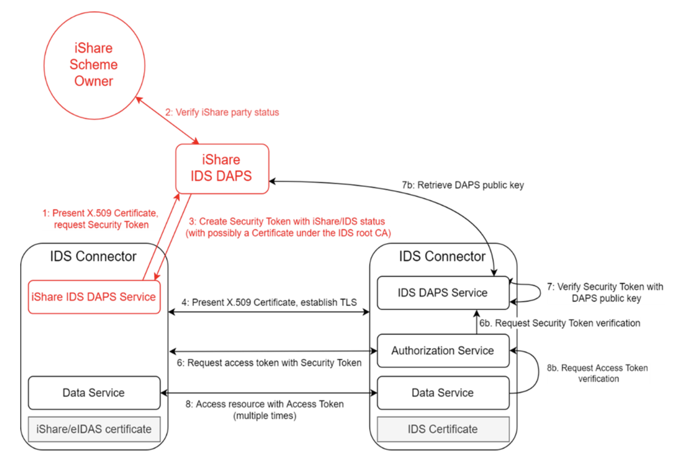
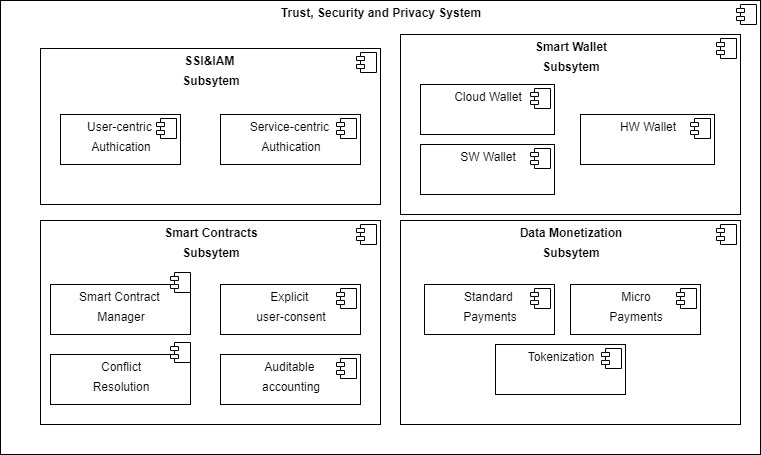

 # Trusted Exchange

 ## Definition

This building block facilitates trusted data exchange among participants, reassuring participants in a data exchange transaction that other participants really are who they claim to be and that they comply with defined rules/agreements. This can be achieved by organisational measures (e.g. certification or verified credentials) or technical measures (e.g. remote attestation).
 

## Role and Scope

Facilitates trusted data exchange among participants.

## Features 

  
<strong>DSBA - CTO architecture coherence</strong>

 
- Security Profiles
- Certification
- Remote Attestation, remote integrity verification
- Trust Authority for verifying trustworthiness of participants
- European identification
- IDS Connector implementation
 

  
<strong>i3-Market Project</strong>

 
- An Identity and Access Management system based on Decentralized/Self Sovereign Identity and Verifiable Credentials
- Smart Wallets with different level of security (Cloud/HW Wallet).
- Smart Contracts.
- A Data monetization system based on crypto currency for secure, trusted and cost-effective peer-to-peer payments.
 
Go to the [source](http://open-source.i3-market.eu/technical-information/i3-market-architecture/).

## Components and Technologies

  
<strong>DSBA - CTO architecture coherence</strong>

 
- IDSA
  - Certification for Base, Trust, Trust+ profiles
  - Certification for Operational Environment and Components
  - Remote Attestation as specified in RAM for Trust and Trust+ profiles
  - Certification body and evaluation facilities
  - eIDAS (planned)
  - IDSA Open Source projects
- Gaia-X 
  - W3C VC (connected to Gaia-X labels and to Gaia-X Compliance(automated compliance checks))
  - Chain of Trustees (Root: eIDAS + AISBL validation)
  - eIDAS
- FIWARE/iSHARE: 
  - [iSHARE Satellite](https://dev.ishareworks.org/scheme-owner/parties.html) with strong contractual framework to provide multi IDP functionality Contributing a strong legal framework and is already operating
  - Keyrock, which supports [eID](https://ec.europa.eu/cefdigital/wiki/display/CEFDIGITAL/eID) / [eIDAS](https://digital-strategy.ec.europa.eu/en/policies/eidas-regulation)
  - Implemented by FIWARE Community: [FIWARE TRUE Connector](https://github.com/Engineering-Research-and-Development/true-connector)
  - IDSA Open Source projects

  

  
<strong>i3-Market Project</strong>

 
- Tokenization
- interaction with the decentralized ledger of the Data Storage system and with the Data Access System for the monetization of the data assets.

  

  
<strong>Smart Connected Supplier Network</strong>

 
 - Digital platforms, interconnected using IDS
 - Independent ‘address book’ for routing communication
 - Several providers
 - One-time integration with own ERP system
 - Registration in the SCSN address book

  
<strong>ECI</strong>

 
 - [ECI Gatewise](https://www.ecisolutions.com/en-gb/)
 - IDS Connector
 - SCSN platform

## Technical Reference Implementation

  
<strong>Design Principles Position Paper</strong>

 

Trust is a necessary feature in any data-sharing environment, i.e. also for predictive maintenance. Unfortunately, predictive maintenance is difficult to achieve, as algorithms used are still not as effective as desired, and the quality of outcome often is not sufficient, due to a lack of reliable data. Nevertheless, integrating and leveraging data from partners – and even from competitors or companies from different sectors (OEMs, maintenance equipment producers, energy companies) – can be of great benefit for all participants.
To overcome the lack of trust currently still prevailing, data sovereignty concepts and services should be employed

 

## Business Use Cases Implementation

  
<strong>ECI</strong>

A metal company purchases metal sheets to their providers as well as they receive orders from customers. Through the SCSN and IDS network they can receive orders through ECI gatewise and the IDS network to supply drive. Therefore, they can send a purchase order to their providers and they can receive purchase orders from their clients, even though they have different platforms. Information can be transmitted no matter where connectors and suppliers are connected, making sure that every type of business gets digitized and isn’t left behind.

  
<strong>ADVANEO DMP</strong>

 

The <a href="https://www.advaneo-datamarketplace.de/en/#">ADVANEO DMP</a> is a collaboration portal that enables the data-sovereign formation of Data Spaces for data-driven applications. Integrated AI tools, data models and applications as well as free access to millions of Open Data support the development of data-driven innovation projects. The DMP has no contact with the actual raw data, being directly transmitted to the interested party in peer-to-peer encrypted form by an IDS-Connector. Only the exploitation result is accessible, enabling the sharing of confidential data in value chains.

## Best practices identification and recommendations

## Gap or what is missing?

## TRL

  
<strong>High TRL</strong>

 
 - High-tech domain: Smart Connected Supplier Network (SCSN) + IDSA

  
<strong>Low TRL</strong>

 
 - Metal domain: Market 4.0
 - Plastic domain: Market 4.0

## Comments

## Additional Information

  
<strong>ECI</strong>

 
 What does IDS bring to our customers?
 - Chain integration: Enable customer supplier connections cross platforms.
 - Service customers: Receive orders from customer via SCSN with engineering drawings.
 - Speed up supply Chain: Send out own digital purchase orders, with less time and faster delivery.
 - Inform customers: Digital dispatch note about what has been sent.
 - Overall productivity improvement of 20%

