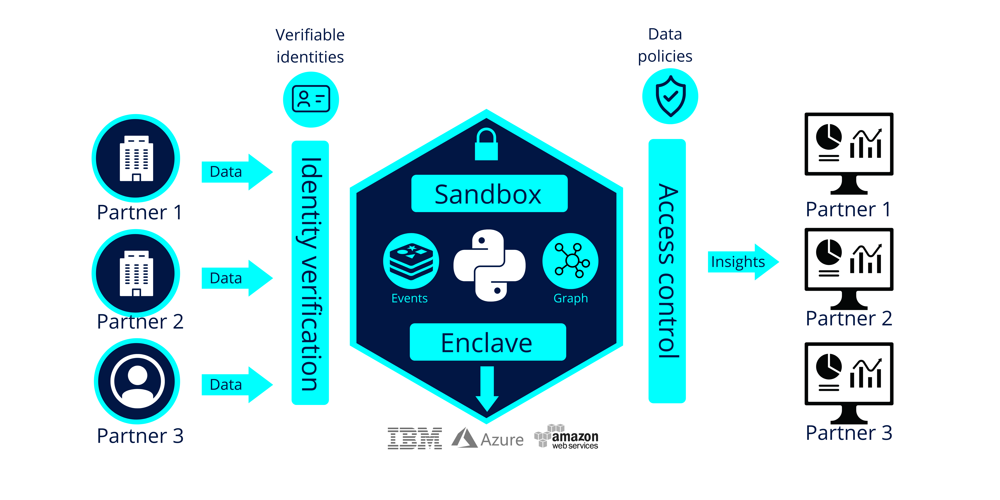

 # Trusted Exchange

 ## Definition

This building block facilitates trusted data exchange among participants, reassuring participants in a data exchange transaction that other participants really are who they claim to be and that they comply with defined rules/agreements. This can be achieved by organisational measures (e.g. certification or verified credentials) or technical measures (e.g. remote attestation).
 

## Role and Scope

Facilitates trusted data exchange among participants.

## Features 

  
<strong>DSBA - CTO architecture coherence</strong>

 
- Security Profiles
- Certification
- Remote Attestation, remote integrity verification
- Trust Authority for verifying trustworthiness of participants
- European identification
- IDS Connector implementation
 

  
<strong>i3-Market Project</strong>

 
- An Identity and Access Management system based on Decentralized/Self Sovereign Identity and Verifiable Credentials
- Smart Wallets with different level of security (Cloud/HW Wallet).
- Smart Contracts.
- A Data monetization system based on crypto currency for secure, trusted and cost-effective peer-to-peer payments.
 
Go to the [source](http://open-source.i3-market.eu/technical-information/i3-market-architecture/).

## Components and Technologies

  
<strong>DSBA - CTO architecture coherence</strong>

 
- IDSA
  - Certification for Base, Trust, Trust+ profiles
  - Certification for Operational Environment and Components
  - Remote Attestation as specified in RAM for Trust and Trust+ profiles
  - Certification body and evaluation facilities
  - eIDAS (planned)
  - IDSA Open Source projects
- Gaia-X 
  - W3C VC (connected to Gaia-X labels and to Gaia-X Compliance(automated compliance checks))
  - Chain of Trustees (Root: eIDAS + AISBL validation)
  - eIDAS
- FIWARE/iSHARE: 
  - [iSHARE Satellite](https://dev.ishareworks.org/scheme-owner/parties.html) with strong contractual framework to provide multi IDP functionality Contributing a strong legal framework and is already operating
  - Keyrock, which supports [eID](https://ec.europa.eu/cefdigital/wiki/display/CEFDIGITAL/eID) / [eIDAS](https://digital-strategy.ec.europa.eu/en/policies/eidas-regulation)
  - Implemented by FIWARE Community: [FIWARE TRUE Connector](https://github.com/Engineering-Research-and-Development/true-connector)
  - IDSA Open Source projects

  

  
<strong>i3-Market Project</strong>

 
- Tokenization
- interaction with the decentralized ledger of the Data Storage system and with the Data Access System for the monetization of the data assets.

  

  
<strong>Smart Connected Supplier Network</strong>

 
 - Digital platforms, interconnected using IDS
 - Independent ‘address book’ for routing communication
 - Several providers
 - One-time integration with own ERP system
 - Registration in the SCSN address book

  
<strong>ECI - TNO</strong>

 
 - [ECI Gatewise](https://www.ecisolutions.com/en-gb/)
 - IDS Connector
 - SCSN platform
 - DAPS

 
<strong>iSHARE Foundation</strong>

 
 - iSHARE Satellite
 - Participant registration service for data spaces, allowing data spaces to make participants known in their data space and also across data spaces.
 - Totally federated 'trust phone book' to discover participants, find the trust level and the roles, and of course the data space.

  
<strong>i4Trust</strong>

 
- [iSHARE Satellite](https://ishare.eu/ishare-satellite-explained/) services are used at this moment.  This service has been defined implementing Trust Anchor functions within data spaces to verify trust of participants.

  
<strong>CS4EU project</strong>

 
- FE2MED (Functional encryption to Medical Data)

## Technical Reference Implementation

  
<strong>Design Principles Position Paper</strong>

 

Trust is a necessary feature in any data-sharing environment, i.e. also for predictive maintenance. Unfortunately, predictive maintenance is difficult to achieve, as algorithms used are still not as effective as desired, and the quality of outcome often is not sufficient, due to a lack of reliable data. Nevertheless, integrating and leveraging data from partners – and even from competitors or companies from different sectors (OEMs, maintenance equipment producers, energy companies) – can be of great benefit for all participants.
To overcome the lack of trust currently still prevailing, data sovereignty concepts and services should be employed

 

  
<strong>AgriSpace4Trust</strong>

 
 <a href="https://i4trust.org/experiments/agrispace4trust/">AgriSpace4Trust</a> aims to integrate i4Trust Marketplace Framework working with FIWARE’s Smart Models and linked data following the latest NGSI-LD specifications. In addition, iSHARE integration to a third-party SensorPassport implementation will build trust within the community. SensorPassport includes functionalities on validating sensor operations, credibility, access, authorization and account control through iSHARE integration.

 

 
<strong>iSHARE Foundation</strong>

 Distributed Ledger node for federated registration of participants in data spaces, hence enabling legal and organisational interoperability.

  
<strong>Datavillage</strong>

 
- 
<a href="https://www.datavillage.me/platform">The Data Cage</a>: A confidential computing environment to process data from different parties while ensuring data confidentiality and algorithm ownership.

 
  - End to end data encryption with algorithm integrity through enclaving
  - No data leak with whitelist sandboxing
  - Automate secure deployment on cloud providers
  - Data access management with data activity ledger
  - Interoperability with linked data and knowledge graph

  
 
- 
<a href="https://www.datavillage.me/platform">The Data Pod</a>: A personal data store where individuals control and manage their data.

 
  - Extend your data mesh with personal data store
  - Rely on user centric data model, feed and connect first and third party data
  - Get customer consent and access data in full transparency
  - Process data from Data Pod to the Data Cage
 
  

  
<strong>i4Trust</strong>

 
- iSHARE provides testing and operation instances of the service.  
- API gateways used in i4Trust are available in the FIWARE Catalogue.  The extended version of the [Kong API gateway via plugins](https://github.com/FIWARE/kong-plugins-fiware) is recommended. 
- [Portfolio](https://i4trust.org/experiments/) of pioneer use cases relying on the i4Trust framework and using iSHARE Satellite services as basis for verifying trust of participants.

  
<strong>CS4EU project</strong>

 
The Functional Encriptation for Medical (FE2MED) asset is used in CyberSec4Europe (CS4EU) projec. CS4RU goal is provide security measures when medical data are shared. It secures data sharing by using this functional encryption tool. 
FE2MED ensures data integrity and confidentiality, 
Leveragecrypto libraries which implement Inner product schemes (e.g., simpleDDH or damgardDDH) for computing data sets providing statistical results to the data consumers. 
It also implements ABE schemes: KP-ABE schemes ensuring that only selected recipients are able to see certain data. 
It provides a graphical user interface for facilitating the KP-ABE use. 
FE2MED is a service currently deployed on premise.
 

 
 It can be ceployed as a Service

 

## Business Use Cases Implementation

  
<strong>ECI - TNO</strong>

A metal company purchases metal sheets to their providers as well as they receive orders from customers. Through the SCSN and IDS network they can receive orders through ECI gatewise and the IDS network to supply drive. Therefore, they can send a purchase order to their providers and they can receive purchase orders from their clients, even though they have different platforms. Information can be transmitted no matter where connectors and suppliers are connected, making sure that every type of business gets digitized and isn’t left behind.

  
<strong>ADVANEO DMP</strong>

 

The <a href="https://www.advaneo-datamarketplace.de/en/#">ADVANEO DMP</a> is a collaboration portal that enables the data-sovereign formation of Data Spaces for data-driven applications. Integrated AI tools, data models and applications as well as free access to millions of Open Data support the development of data-driven innovation projects. The DMP has no contact with the actual raw data, being directly transmitted to the interested party in peer-to-peer encrypted form by an IDS-Connector. Only the exploitation result is accessible, enabling the sharing of confidential data in value chains.

  
<strong>Vastuu Group</strong>

 
The goal of the <a href="https://www.vttresearch.com/en/news-and-ideas/secure-sharing-supports-data-sovereignty-and-business-between-organisations">project</a> was to use the IDS standard to reveal the energy consumption and emissions information found in Helsinki Region Transport’s (HSL) and a specific city district’s data platforms. This way the data of both public transport and buildings could be taken into account when searching for ways to reduce the energy consumption and carbon footprint in a certain area. The project required developing a solution that would enable smooth data transfer without sacrificing information security.

 
 

  
<strong>AgriSpace4Trust</strong>

 
 <a href="https://i4trust.org/experiments/agrispace4trust/">AgriSpace4Trust</a> enables the prosumption of data services to optimise energy inputs in olive production creating new data-driven services. It proposes to create data hubs supported by i4trust data space that exploit local weather stations or agro-environmental sensors and open them to a broader community of local users. This way, opinion leaders and tech-savvy farmers will invest in buying specialised equipment, and data can be shared at will, including cooperatives and farm advisors/ agronomists.

 

  
<strong>Datavillage</strong>

 
 - <strong>TAILORED CONTENT DISCOVERY FOR END-USERS</strong>
 
Enable the analysis and processing of sensitive personal data aiming better content recommendation through data sourced directly by your users in a compliant and secure way. Let users consume online content on multiple platforms with their own reputation, identity and history. Don't collect the data in your system but access and process it via the end-users Data Pod and the Data Cage.

 

 -  <strong>TAILORED CONTENT DISCOVERY FOR END-USERS</strong>
 
 Enable the exploration and processing of user behaviors with other media & entertainment companies in a compliant and secure way (GDPR, e-privacy ...).
 

 

  
<strong>CS4EU project</strong>

Use Case MD-UC1: Sharing Sensitive Health Data Through an API The FE2MED asset, used in CyberSec4Europe project, secures data sharing by using this functional encryption tool. 
 
The Medical Data Exchange demonstrator is intended to increase the trustworthiness between stakeholders when sharing medical data through a marketplace platform thus generating new business opportunities. This will be achieved by using a real environment provided by the COVID-19 Data Exchange platform50 (COV19DEP)launched by Dawex, which will offer to the users an anonymization service and a functional encryption service for increasing the user privacy and security when sharing data.
 

 The figure below shows the basic flow of this Medical Data use case.
 

 

## Best practices identification and recommendations

 
<strong>iSHARE Foundation</strong>

 
 -  There is a governance structure to the ledger and hence provides measures for changes and eventual fixes. 

  
<strong>Datavillage</strong>

 
 - Flexibility to deploy on any cloud provider
 - Development environment with test data required
 - In memory processing
 

  
<strong>CS4EU project</strong>

 The main functionalities should be deployed on the data provider infrastructure for minimising data leaks.

## Gap or what is missing?

  
<strong>Datavillage</strong>

 
 - A database integrated into the confidential computing environement is missing. We are looking to integrate an in memory graph database like redis.
 

  
<strong>i4Trust</strong>

 
- Convergence with other alternative Trust Anchor services (Gaia-X, IDS, EBSI) is being analysed under the DSBA (Data Spaces Business Alliance).

  
<strong>CS4EU project</strong>

 
 User interface could be made more friendly and additional crypto schemes can be included. 
 Mechanisms for sharing decrypting keys.
 

## TRL

  
<strong>High TRL</strong>

 
 - High-tech domain: Smart Connected Supplier Network (SCSN) + IDSA

  
<strong>Low TRL</strong>

 
 - Metal domain: Market 4.0
 - Plastic domain: Market 4.0

## Comments

## Additional Information

 
<strong>iSHARE Foundation</strong>

Find more information in <a href="https://ishare.eu/">iSHARE Foundation's<a> webpage.

 

  
<strong>i4Trust</strong>

 
 More information about iSHARE can be found here: 
- [Portal for developers](https://dev.ishare.eu/)
- [iSHARE wiki](https://ishareworks.atlassian.net/wiki/spaces/IS/pages/70222191/iSHARE+Scheme)
- [Additional info](https://github.com/i4Trust/building-blocks)

 
 

  
<strong>CS4EU project</strong>

 More information about Cyber Security for Europe project and the use cases are described at the D5.5 Specification and set-up demonstration case Phase 2.
 [https://cybersec4europe.eu/wp-content/uploads/2022/01/D5.5-Specification-and-set-up-demonstration-case-Phase-2-v1.0_submitted.pdf]

